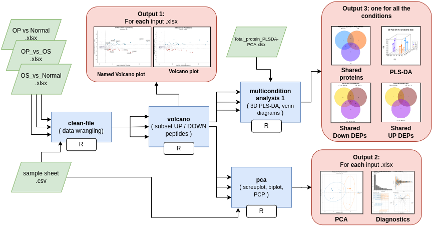

# Proteomic compare
NF pipeline for running comparative proteomic analyses

### Workflow overview


===  

- A tool for comparing conditions in Synapt G2-Si Mass Spectrometer data

- This pipeline is meant to reproduce the results in: TO-DO-add url and doi after paper is published

The pipeline takes as INPUT an excel samplesheet created by UGPM, LaNSE, Cinvestav-IPN from a Synapt G2-Si Mass Spectrometer. Contact Emmanuel Castro-Rios (eriosc@cinvestav.mx) for more info. It also takes a .csv samplesheet describing sampleID_replicate and the condition (i.e. control vs treatment). It also takes a pre-built "Total_protein_PLSDA-PCA.xlsx" wide-format table with all of the samples (rows) and all of the proteins (columns) quantifiedM; this last one is used to reproduce figures on the paper. 

'Proteomic compare' is a pipeline tool that takes peptide quantifications in excel format and process it to generate a volcano plot and PCA of comparisons between conditions. This pipeline generates the followin outputs:  
For each INPUT .xlsx
1) a figure of a volcano plot with UP and DOWN peptides;  
2) a figure same as 1) but with labeled peptides;  
3) a figure of a PCA plot created from the UP and DOWN peptides;
4) a figure of a panel diagnostics for 3), including a screeplot, a Parallel Coordinate Plot, a Biplot, and a labeled PCA with sample names.  

For the pre-built Total_protein_PLSDA-PCA.xlsx
5) a figure showing the intersection for detected proteins in each condition;  
6) a figure showing the intersection for DOWN-expressed proteins in each condition; 
7) a figure showing the intersection for UP-expressed proteins in each condition;
8) a figure showing 3D rendering of the PLS coordinates for the 3 first components, using all of the sampels for all of the conditions.

---

### Features
  **-v 0.0.1**

* Supports .xlsx files from  UGPM, LaNSE, Cinvestav-IPN from a Synapt G2-Si Mass Spectrometer
* Results include labelled and unlabelled volcano plot
* Results include PCA and a diagnostics screeplot, PCP, and biplot
* Scalability and reproducibility via a Nextflow-based framework   

  **-v 0.0.2.1**

* Support a "Total_protein_PLSDA-PCA.xlsx" pre-built to create plots for comparing multiple conditions
* Paper fully reproducible with Docker

---

## Requirements
#### Compatible OS*:
* [Ubuntu 20.04.5 LTS](https://releases.ubuntu.com/focal/)

#### Incompatible OS*:
* UNKNOWN  

\* Proteomic compare may run in other UNIX based OS and versions, but testing is required.  

#### Command line Software required:
| Requirement | Version  | Required Commands * |
|:---------:|:--------:|:-------------------:|
| [Nextflow](https://www.nextflow.io/docs/latest/getstarted.html) | 22.10.4 | nextflow |
| [R](https://www.r-project.org/) | 4.2.2 | Rscript |

\* These commands must be accessible from your `$PATH` (*i.e.* you should be able to invoke them from your command line).  

#### R packages required:

```
cowplot version: 1.1.1
dplyr version: 1.1.2
factoextra version: 1.0.7
ggplot2 version: 3.4.2
ggrepel version: 0.9.3
ggsci version: 3.0.0
matrixStats version: 1.0.0
openxlsx version: 4.2.5.2
scales version: 1.2.1
stringr version: 1.5.0
tidyr version: 1.3.0
ggvenn version: 0.1.10
ropls version: 1.32.0
scatterplot3d version: 0.3-44 
purrr version: 1.0.1
```

---

### Installation
Download pipeline from Github repository:  
```
git clone git@github.com:Iaguilaror/low_BMD_in_PMWMX.git
```

---

## Replicate our analysis (Testing the pipeline):

* Estimated test time:  **5 minute(s)**  

1. To test pipeline execution using test data, run:  
```
./runtest.sh
```

2. Your console should print the Nextflow log for the run, once every process has been submitted, the following message will appear:  
```
======
 Basic pipeline TEST SUCCESSFUL
======
```

3. Pipeline results for test data should be in the following directory:  
```
./paper-results/
```
---

## Replicate our analysis with Docker:

#### Command line Software required:
| Requirement | Version  | Required Commands * |
|:---------:|:--------:|:-------------------:|
| [Nextflow](https://www.nextflow.io/docs/latest/getstarted.html) | 22.10.4 | nextflow |

\* These commands must be accessible from your `$PATH` (*i.e.* you should be able to invoke them from your command line).  

* Estimated test time:  **5 minute(s)**  

1. To test pipeline execution using test data, run:  
```
bash docker-replicate-analysis.sh
```

2. Your console should print the Nextflow log for the run, once every process has been submitted, the following message will appear:  
```
======
 Basic pipeline TEST SUCCESSFUL
======
```

3. Pipeline results for test data should be in the following directory:  
```
./paper-results/
```

---

### Pipeline Inputs

* An `.xlsx excel samplesheet` created by UGPM, LaNSE, Cinvestav-IPN from a Synapt G2-Si Mass Spectrometer. Contact Emmanuel Castro-Rios (eriosc@cinvestav.mx) for more info.  

NAMING CONVENTION: filename should be CONDITION1_vs_CONDITION2.xlsx, because the condition names will be taken from the filename.  

Example contents  
```
sheet number or name: 1
Accession	Peptide count	Unique peptides	Confidence score	Anova (p)	nlog.Anova	q Value	Max fold change	Power	Highest mean condition	Lowest mean condition	Mass	Description	20220608_34_HDMSE_N_P1_R001	20220608_34_HDMSE_N_P1_R002	20220608_34_HDMSE_N_P1_R003	20220608_35_HDMSE_N_P2_R001
Q2M243;J3QKX2	5	1	27.3012	3.90E-08	7.40898498193687	3.45E-07	4.42850961640127	0.999999916484847	Normal	Osteoporosis	75867.8723	Coiled-coil domain-containing protein 27 OS=Homo sapiens OX=9606 GN=CCDC27 PE=1 SV=2	37894.2229766787	44809.8331347101	37940.595720904	61166.4163882289
...
```

* A `.csv samplesheet` describing sampleID_replicate and the condition.  
Example lines  
```
muestra	condition
20220608_34_HDMSE_N_P1_R001	Normal
20220608_34_HDMSE_N_P1_R002	Normal
20220608_34_HDMSE_N_P1_R003	Normal
20220608_44_HDMSE_OP_PI_R001	OP
20220608_44_HDMSE_OP_PI_R002	OP
20220608_44_HDMSE_OP_PI_R003	OP
...
```

* A ` "Total_protein_PLSDA-PCA.xlsx", excel file` that includes all of the detected proteins in the evaluated conditions, in table format.  

Example contents  
```
sample_id       condicion       P04217  P01023  Q8WWZ7  Q09428
20220608_34_HDMSE_N_P1_R001     N       36353.52363     50338.57254     0       0
20220608_34_HDMSE_N_P1_R002     N       41329.12922     52938.46197     17.76093614     0
20220608_34_HDMSE_N_P1_R003     N       38530.74795     49830.05592     0       1.475326865
20220608_36_HDMSE_N_P3_R001     N       27093.23423     45550.87057     109.1547172     4.376165809
20220608_36_HDMSE_N_P3_R002     N       26938.02884     44113.33152     42.30108357     16.80307341
20220608_36_HDMSE_N_P3_R003     N       25023.78261     45638.40939     75.33983583     12.10888364
20220608_37_HDMSE_N_P4_R001     N       45232.14913     57859.06924     57.86140548     1246.738609	
...
```

---

### Pipeline Results

Inside the directory paper-results/ you can find the following:

* A `.volcano.png figure` with the figure showing a volcano plot.  

* A `.volcano.named.png image` same as above but highlighting top UP and DOWN peptides.  

* A `.UP_and_DOWN_hits.xlsx excel file` that includes only UP and DOWN differentiated peptides according to the thresholds hardcoded in the volcano.R script.  

* A `.PCA_main.png figure` with the figure showing a PCA for two conditions.  

* A `PCA_diagnostic.png image` same as above but showing a panel with: screeplot, labeled PCA, a Parallel Coordinate Plot, and a biplot. Meant to provide an overview of the whole PCA.  

* A `VENN_shared.png figure` with the figure showing the intersection for detected proteins in each condition.  

* A `VENN_shared_DEP_DOWN.png figure` with the figure showing the intersection for DOWN-expressed proteins in each condition.  

* A `VENN_shared_DEP_UP.png figure` with the figure showing the intersection for UP-expressed proteins in each condition.  

* A `PLS-DA.png figure` with the figure showing 3D rendering of the PLS coordinates for the 3 first components, using all of the sampels for all of the conditions.  

---

### module directory structure

````
.
├── dev_notes/                                # includes development notes like the png for the workflow
├── docker_material/                          # docker file and readme to build, tag and push the dockerimage
├── docker-replicate-analysis.sh              # bash script to launch the pipeline test with docker
├── main.nf                                   # the Nextflow main script
├── modules/                                  # sub-dirs for development of the Nextflow modules
├── paper-results/                            # here will be the figures and tables after runing the *replicate-analysis script
├── README.md                                 # This readme
├── real-data/                                # directory with the real xlsx and samplesheet files
├── replicate-analysis.sh -> runtest.sh       # a symlink to runtest.sh
├── runtest.sh                                # bash script to launch the pipeline test locally
└── scripts/                                  # directory with all the scripts used by the pipeline
````

---
### References
Under the hood Proteomic compare uses some coding tools, please include the following ciations in your work:

* Di Tommaso, P., Chatzou, M., Floden, E. W., Barja, P. P., Palumbo, E., & Notredame, C. (2017). Nextflow enables reproducible computational workflows. Nature Biotechnology, 35(4), 316–319. doi:10.1038/nbt.3820

* Team, R. C. (2017). R: a language and environment for statistical computing. R Foundation for Statistical Computing, Vienna. http s. www. R-proje ct. org.

* Thevenot EA, Roux A, Xu Y, Ezan E, Junot C (2015). “Analysis of the human adult urinary metabolome variations with age, body mass index and gender by implementing a comprehensive workflow for univariate and OPLS statistical analyses.” Journal of Proteome Research, 14, 3322-3335.
  
* Wickham H, Averick M, Bryan J, Chang W, McGowan LD, François R, Grolemund G, Hayes A, Henry L, Hester J, Kuhn M, Pedersen TL, Miller E, Bache SM, Müller K, Ooms J, Robinson D, Seidel DP, Spinu V, Takahashi K, Vaughan D, Wilke C, Woo K, Yutani H (2019). “Welcome to the tidyverse.” Journal of Open Source Software, 4(43), 1686. doi:10.21105/joss.01686.

* Ligges U, Mächler M (2003). “Scatterplot3d - an R Package for Visualizing Multivariate Data.” Journal of Statistical Software, 8(11), 1–20. doi:10.18637/jss.v008.i11.

---

### Contact
If you have questions, requests, or bugs to report, open an issue in github, or email <iaguilaror@gmail.com>

### Dev Team
Israel Aguilar-Ordonez <iaguilaror@gmail.com>   
Adriana Becerra Cervera <abecerra@inmegen.edu.mx>   
Diana Ivette Aparicio Bautista <daparicio@inmegen.gob.mx>   
Rafael Velazquez Cruz <rvelazquez@inmegen.gob.mx>

### Cite us
https://link.springer.com/article/10.1007/s11357-023-00977-1
